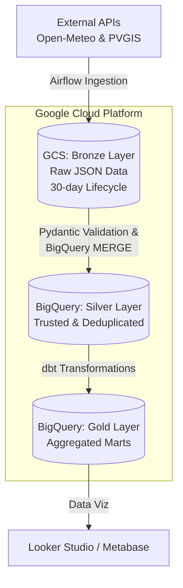

# Renewable Energy FinOps Pipeline

> This repository contains an end-to-end Data Engineering pipeline focused on processing climate and solar energy data. Built with a strong emphasis on Cloud Cost Optimization (FinOps) and Data Quality, the system ingests data from external APIs (Open-Meteo and PVGIS) and processes it through a robust Medallion Architecture (Bronze, Silver, and Gold layers).

---

## Core Technologies
* **Languages & Environment:** Python, Docker.
* **Cloud Platform:** Google Cloud Platform (GCS, BigQuery).
* **Infrastructure as Code (IaC):** Terraform.
* **Orchestration & Transformation:** Apache Airflow, dbt (Data Build Tool).
* **CI/CD & Analytics:** GitHub Actions, Looker Studio / Metabase.

---

## Key Technical Highlights
* **Zero-Key Security:** Implemented GCP Workload Identity Federation (WIF) via GitHub Actions, completely eliminating the need to store static JSON keys.

...

---

## Medallion Architecture Flow

---

**Built by:** @camillefk  
**Created:** August 2026  
**Last Updated:** August 09, 2026